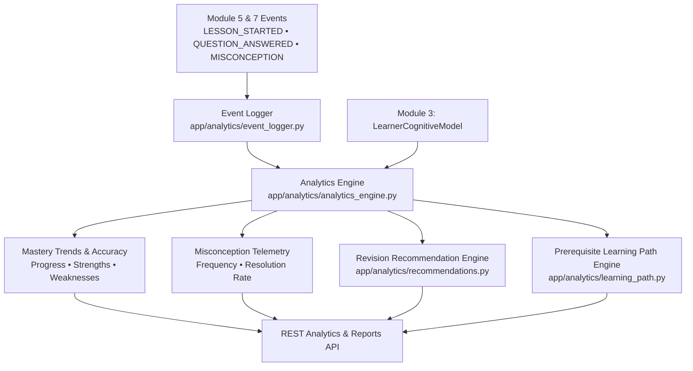

# Module 10: Learning Analytics & Recommendation Engine

**Module Owner:** Member 4  
**Namespace:** `app.analytics` / `/api/v1/analytics`  
**Status:** 🟢 Production Hardened & Verified (5/5 tests passing)  

---

## 1. Overview
Module 10 provides student-facing and teacher-facing cognitive analytics, longitudinal mastery tracking, misconception recurrence monitoring, and adaptive curriculum recommendations.

It ingests real learning events from Module 5 (Teaching Harness), Module 7 (Assessment), and Module 3 (Cognitive Model) without generating ungrounded or fabricated metrics.



---

## 2. Core Capabilities

### A. Real-Time Telemetry Event Logger
Tracks fine-grained learning events (`LearningEvent`) with strict schema typing:
- `LESSON_STARTED` / `LESSON_COMPLETED`
- `CONCEPT_INTRODUCED` / `CONCEPT_MASTERED`
- `QUESTION_ANSWERED` (with score, response duration, strategy)
- `MISCONCEPTION_DETECTED` / `MISCONCEPTION_RESOLVED`
- `REVISION_COMPLETED`

### B. Accurate Student Progress & Mastery Computation
- Computes actual question accuracy rates: $\text{Accuracy} = \frac{\text{Correct Attempts}}{\text{Total Attempts}}$
- Computes misconception resolution rate: $\text{Resolution Rate} = \frac{\text{Resolved Misconceptions}}{\text{Total Diagnosed Misconceptions}}$
- Tracks mastery trends (`IMPROVING`, `STABLE`, `DECLINING`, `NEW`) per individual concept.
- Logs study duration, learning streaks, strengths, and active weak areas.

### C. Prerequisite-Aware Learning Path Graph
Navigates directed acyclic curriculum graphs (DAGs) across subjects (Physics, Math, Programming, Biology).
- Prevents cognitive overload by blocking topics whose prerequisite concepts have not achieved mastery ($\ge 0.60$).
- Identifies `completed_topics`, `next_topics`, `blocked_topics`, and `recommended_topics`.

---

## 3. Data Contracts

```python
class LearningEvent(BaseModel):
    event_id: str
    learner_id: str
    session_id: Optional[str]
    concept_id: str
    event_type: LearningEventType
    timestamp: datetime
    score: Optional[float]
    difficulty: int
    strategy: Optional[TeachingStrategy]
    language: str
    duration_seconds: float
    payload: Dict[str, Any]

class ConceptAnalytics(BaseModel):
    concept: str
    mastery: float
    confidence: float
    total_attempts: int
    correct_attempts: int
    incorrect_attempts: int
    misconceptions: List[str]
    last_studied: datetime
    trend: MasteryTrend
    recommended_action: str

class LearningReportSummary(BaseModel):
    report_id: str
    learner_id: str
    session_id: str
    subject: str
    total_duration_minutes: float
    final_score: float
    concepts_understood: List[str]
    weak_concepts: List[str]
    misconceptions_detected: List[str]
    resolved_misconceptions: List[str]
    recommended_revisions: List[RevisionRecommendation]
    recommended_next_topics: List[str]
    overall_feedback: str
```

---

## 4. REST API Reference

| Method | Endpoint | Description |
| :--- | :--- | :--- |
| `GET` | `/api/v1/analytics/<learner_id>` | High-level progress summary (mastery, accuracy, study time, streak). |
| `GET` | `/api/v1/analytics/<learner_id>/mastery` | Detailed per-concept analytics with trends and remediation advice. |
| `GET` | `/api/v1/analytics/<learner_id>/misconceptions` | Diagnosed misconception frequencies and resolution rates. |
| `GET` | `/api/v1/analytics/<learner_id>/history` | Full chronological audit trail of learning telemetry events. |
| `GET` | `/api/v1/analytics/<learner_id>/learning-path` | Prerequisite-aware personalized learning roadmap. |
| `POST` | `/api/v1/recommendations/generate` | Prioritized revision recommendations (HIGH/MEDIUM/LOW). |
| `GET` | `/api/v1/reports/<session_id>` | Comprehensive session end report with mastery changes and advice. |
