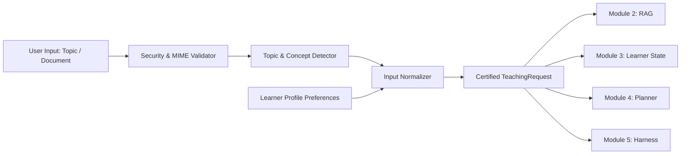

# Module 1: Student & Input Intelligence

**Module Owner:** Member 1  
**Namespace:** `app.input` / `/api/v1/input`  
**Status:** 🟢 Production Hardened & Verified (15/15 tests passing)  

---

## 1. Overview
Module 1 serves as the unified ingestion and normalization gateway for the AI Teacher platform. It processes raw educational inputs—including uploaded documents (PDF, DOCX, PPTX, TXT, Markdown) or direct topic entries—and pairs them with granular learner cognitive preferences to produce a certified, strongly-typed `TeachingRequest`.



---

## 2. Core Capabilities

### A. Supported Formats & Security Guards
- **Formats:** PDF, DOC, DOCX, PPT, PPTX, TXT, Markdown, Direct Topic, Chapter Name, Concept Name.
- **Security Validation:**
  - Maximum upload size enforcement (50 MB).
  - Magic byte verification (`%PDF`, `PK\x03\x04`).
  - Strict filename sanitization and path traversal prevention (`os.path.basename` + UUID storage).
  - Rejection of empty or corrupted payloads.

### B. Learner Preferences & Cognitive Profiles
- **Educational Levels:** `BEGINNER`, `INTERMEDIATE`, `ADVANCED`.
- **Time Budgets:** `5_MIN`, `20_MIN`, `60_MIN`, `CUSTOM` (1 to 120 minutes).
- **Teaching Styles:** `SIMPLE`, `DETAILED`, `EXAM_FOCUSED`, `PRACTICAL`, `SOCRATIC`.
- **Question Preferences:** `MCQ`, `CONCEPTUAL`, `SHORT_ANSWER`, `PROBLEM_SOLVING`, `APPLICATION`.
- **Language Independence:** Distinguishes `material_language` (e.g. English textbook) from `requested_language` (e.g. Hindi/Tamil teaching).

---

## 3. Data Contracts

```python
class TeachingRequest(BaseModel):
    request_id: str
    learner_id: str
    source_type: str  # direct_topic | uploaded_document
    source_reference: Optional[str]
    topic: str
    subject: str
    chapter: Optional[str]
    concepts_list: List[str]
    requested_language: str
    material_language: str
    learner_level: LearnerLevel
    available_time: TimeBudget
    time_minutes: int
    learning_objective: str
    teaching_style: TeachingStyle
    desired_depth: str
    requested_question_types: List[QuestionPreferenceType]
    learner_profile: Optional[LearnerProfile]
```

---

## 4. REST API Reference

| Method | Endpoint | Description |
| :--- | :--- | :--- |
| `POST` | `/api/v1/input/topic` | Submits a direct topic with learner preferences and generates a `TeachingRequest`. |
| `POST` | `/api/v1/input/upload` | Multipart form upload for educational files with automatic subject detection. |
| `POST` | `/api/v1/input/validate` | Validates file extensions, headers, and topic strings without persistent writes. |
| `POST` | `/api/v1/input/normalize` | Converts raw JSON dictionary into a normalized `TeachingRequest`. |
| `GET` | `/api/v1/input/<request_id>` | Retrieves a previously created `TeachingRequest` by ID. |
