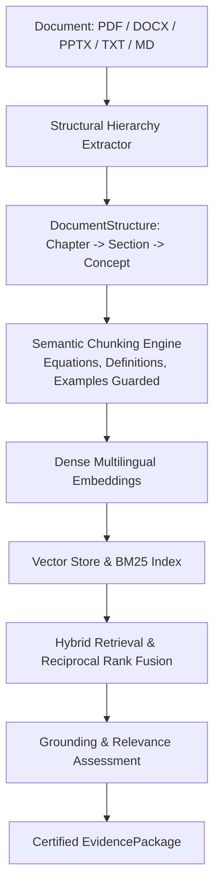

# Module 2: Document Processing + Educational RAG

**Module Owner:** Member 1 & Member 2  
**Namespace:** `app.rag` / `/api/v1/documents` & `/api/v1/rag`  
**Status:** 🟢 Production Hardened & Verified (7/7 tests passing)  

---

## 1. Overview
Module 2 converts unstructured educational materials into structured, semantic knowledge. It ensures zero-hallucination teaching by enforcing strict grounding levels (`SUPPORTED`, `PARTIALLY_SUPPORTED`, `UNSUPPORTED`).

---

## 2. Document Extraction & Structure
- **Hierarchical Parsing:** Extracts `DocumentStructure` $\to$ `ChapterNode` $\to$ `SectionNode` $\to$ `ConceptNode` $\to$ `DefinitionNode`, `FormulaNode`, `ExampleNode`.
- **Zero-Dependency Native Fallbacks:**
  - PDF: PyMuPDF (`fitz`) or native object stream parser.
  - DOCX: `python-docx` or native XML ZIP parser (`word/document.xml`).
  - PPTX: `python-pptx` or native slide XML ZIP parser.
  - TXT/MD: Native regex header and definition parser.

---

## 3. Grounding Policy & Hallucination Elimination

| Grounding Level | Score Range | System Action | Downstream Impact |
| :--- | :---: | :--- | :--- |
| `SUPPORTED` | $\ge 0.48$ | Returns certified evidence excerpts with page and chapter citations. | Planner and Teacher proceed with high confidence. |
| `PARTIALLY_SUPPORTED` | $0.22 - 0.47$ | Returns partial excerpts with explicit limitations note. | Teacher acknowledges partial coverage. |
| `UNSUPPORTED` | $< 0.22$ | Emits `"Insufficient evidence in the provided material."` | System refuses to hallucinate ungrounded facts. |

---

## 4. REST API Reference

| Method | Endpoint | Description |
| :--- | :--- | :--- |
| `POST` | `/api/v1/documents/upload` | Uploads and validates an educational document. |
| `POST` | `/api/v1/documents/process` | Extracts hierarchy, chunks, and indexes document into vector store. |
| `GET` | `/api/v1/documents/<id>` | Retrieves document metadata. |
| `GET` | `/api/v1/documents/<id>/structure` | Retrieves full chapter/section/concept tree. |
| `POST` | `/api/v1/rag/search` | Performs hybrid search (dense + keyword). |
| `POST` | `/api/v1/rag/evidence` | Produces certified `EvidencePackage` for Planner and Harness. |
