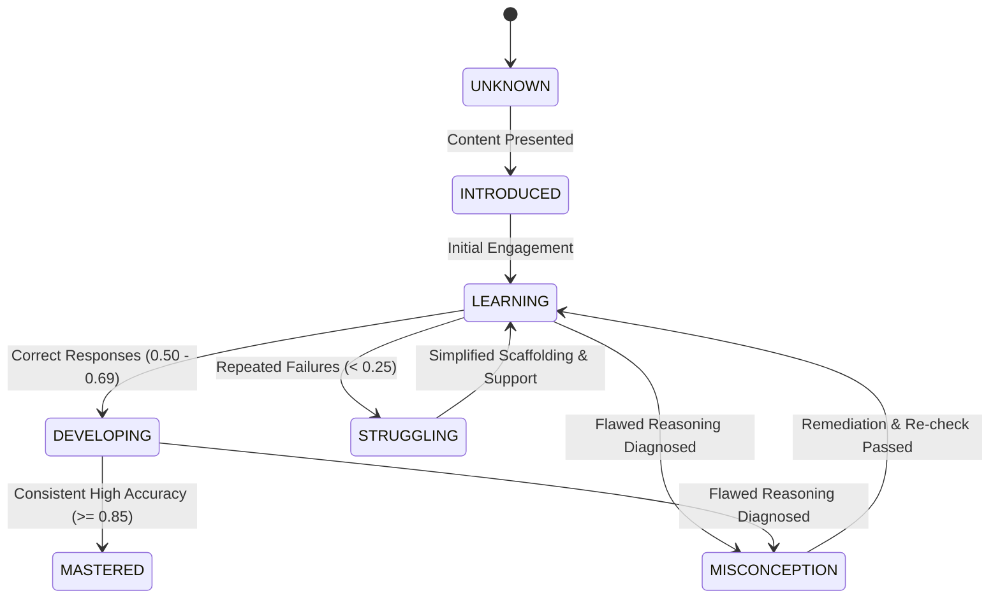

# Module 3: Learner Cognitive Model

**Module Owner:** Member 2  
**Namespace:** `app.learner` / `/api/v1/learners`  
**Status:** 🟢 Production Hardened & Verified (6/6 tests passing)  

---

## 1. Overview
Module 3 maintains a persistent, continuous cognitive profile representing what each student understands, where they struggle, what misconceptions they hold, and which teaching strategies have proven effective for their learning style.

---

## 2. Knowledge State Transitions

---

## 3. Mathematical Mastery Update Engine

Mastery is a continuous score ($0.0 \le M \le 1.0$) updated dynamically on student evidence:

$$M_{t+1} = \text{clamp}\left(M_t + \Delta, 0.0, 1.0\right)$$

- **Correct Response on Level $D$ ($1 \le D \le 5$):**
  $$\Delta = (0.10 + 0.04 \cdot D) \cdot \text{Score} \cdot \text{Confidence}$$
- **Re-check Recovery after Remediation:**
  $$\Delta = +0.25 \cdot \text{Confidence}$$
- **Diagnosed Conceptual Misconception (High Severity):**
  $$\Delta = -0.20 \cdot \text{Confidence}$$

---

## 4. Misconception & Strategy Memory
- **Misconception Frequency:** Increments when the same error is repeated across sessions, alerting the planner to allocate additional conceptual reinforcement.
- **Strategy Effectiveness Record:** Documents which pedagogical interventions (e.g. `SIMPLE_ANALOGY`, `STEP_BY_STEP`) successfully yielded positive mastery deltas for the specific learner.
- **Language Independence:** Cognitive state, concept mastery, and misconception nodes remain strictly language-neutral. A student switching from English to Hindi or Tamil retains their exact mastery history.

---

## 5. REST API Reference

| Method | Endpoint | Description |
| :--- | :--- | :--- |
| `GET` | `/api/v1/learners/<id>` | Full cognitive profile and concept breakdown. |
| `GET` | `/api/v1/learners/<id>/concepts` | Current knowledge states, strengths, and weak concepts. |
| `GET` | `/api/v1/learners/<id>/mastery` | Overall mastery level and per-concept scores. |
| `GET` | `/api/v1/learners/<id>/misconceptions` | Diagnosed misconceptions, severity, and resolution status. |
| `GET` | `/api/v1/learners/<id>/history` | Chronological answer logs and strategy effectiveness history. |
| `POST` | `/api/v1/learners/<id>/mastery/update` | Updates student mastery based on question evaluation evidence. |
