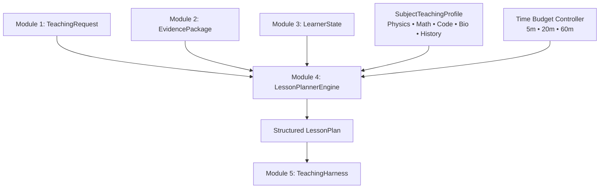

# Module 4: AI Lesson Planner

**Module Owner:** Member 2 & Member 3  
**Namespace:** `app.planner` / `/api/v1/planner`  
**Status:** 🟢 Production Hardened & Verified (8/8 tests passing)  

---

## 1. Overview
Module 4 synthesizes three core inputs:
1. `TeachingRequest` (Module 1: Student Input)
2. `EvidencePackage` (Module 2: Educational RAG)
3. `LearnerCognitiveState` (Module 3: Learner Cognitive Model)

It produces a structured, time-adapted, level-adapted, and RAG-grounded `LessonPlan` containing discrete `LessonSegment` nodes that govern the runtime execution in Module 5 (Teaching Harness).

---

## 2. Time-Aware Timeline Invariants

| Time Budget | Structure & Segment Flow | Purpose |
| :--- | :--- | :--- |
| **5 Minutes** | Intro/Core Concept (2.5m) $\to$ Checkpoint Question (2.5m) | Quick conceptual sprint and rapid assessment. |
| **20 Minutes** | Intro (3m) $\to$ Core Concept & Primary Visual (6m) $\to$ Checkpoint 1 (4m) $\to$ Worked Example (4m) $\to$ Final Assessment (3m) | Standard classroom lesson with balanced theory and application. |
| **60 Minutes** | Foundation (8m) $\to$ Core Theory & Diagram (12m) $\to$ Checkpoint 1 (6m) $\to$ Advanced Application & Secondary Analogy (14m) $\to$ Quantitative Problem Checkpoint (10m) $\to$ Summary (10m) | In-depth conceptual mastery and exam challenge. |

---

## 3. Adaptive Replanning (`replan_after_evaluation`)
When Module 7 evaluates a student response:
- **Correct Answer:** Planner emits an `extension_and_mastery` segment advancing to broader applications.
- **Diagnosed Misconception:** Planner dynamically swaps in a `remediation` segment with a new strategy (e.g. `SIMPLE_ANALOGY` instead of `DIRECT_EXPLANATION`), switches the visual (e.g. Water Pipe Analogy), and schedules a targeted re-check question.

---

## 4. REST API Reference

| Method | Endpoint | Description |
| :--- | :--- | :--- |
| `POST` | `/api/v1/planner/generate` | Generates a structured `LessonPlan` from learner inputs. |
| `POST` | `/api/v1/planner/replan` | Computes an adaptive replacement segment based on misconception feedback. |
| `GET` | `/api/v1/planner/<lesson_id>` | Retrieves a cached or persisted `LessonPlan` by ID. |
