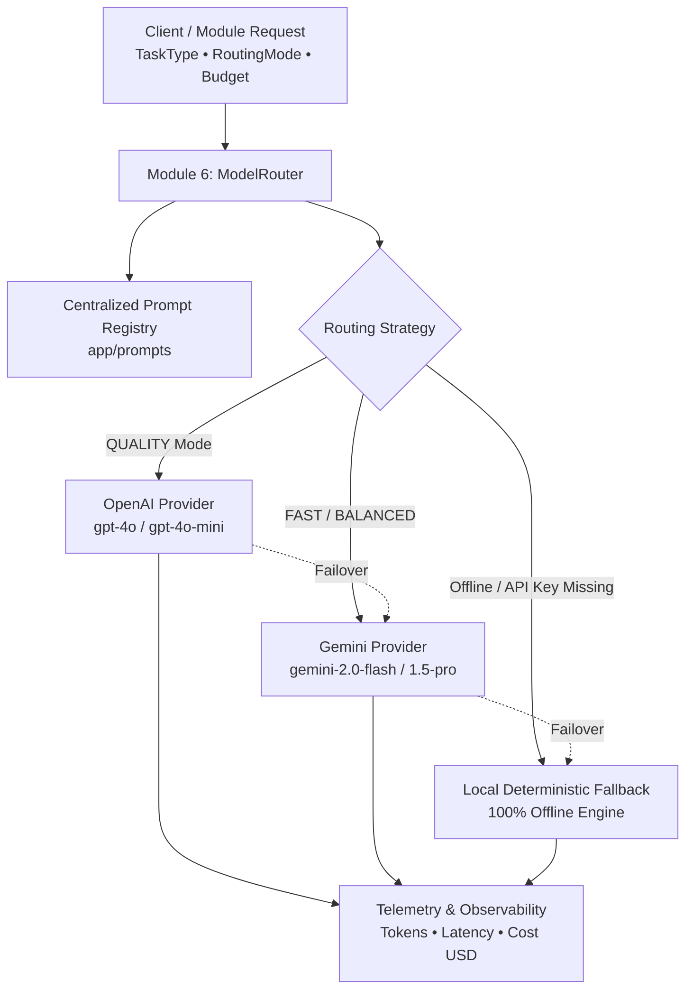

# Module 6: AI Model Intelligence & Model Router

**Module Owner:** Member 3  
**Namespace:** `app.router` / `app.prompts` / `/api/v1/router`  
**Status:** 🟢 Production Hardened & Verified (5/5 tests passing)  

---

## 1. Overview
Module 6 separates **AI capability routing** (model selection, cost optimization, latency budgeting, structured prompt generation, token observability) from **pedagogical orchestration** (Module 5: Teaching State Machine).

It evaluates inbound task requirements, routes requests to the optimal AI model provider (OpenAI GPT-4o, Google Gemini 2.0/1.5, or Zero-Dependency Local Fallback), executes requests through resilient fallback chains, and records token/latency/cost telemetry.



---

## 2. Core Capabilities

### A. Supported Task Types
- `LESSON_PLANNING`: Complex pedagogical curriculum layout.
- `EXPLANATION`: Direct conceptual breakdowns and analogies.
- `QUESTION_GENERATION`: Diagnostic MCQ, conceptual, and quantitative checks.
- `ANSWER_EVALUATION`: Semantic grading against rubric criteria.
- `MISCONCEPTION_ANALYSIS`: Root-cause diagnosis of student errors.
- `TRANSLATION`: Multilingual translation preserving scientific accuracy.
- `VISUAL_PLANNING`: SVG, Mermaid, and 3D simulation scene planning.
- `RECOMMENDATION`: Prerequisite and reinforcement planning.
- `SUMMARIZATION` / `RAG_QUERY_REWRITE`: Retrieval expansion.

### B. Routing Modes
| Mode | Priority | Target Latency | Preferred Provider & Model |
| :--- | :--- | :--- | :--- |
| `FAST` | Sub-second interactive response | $< 500$ ms | `gemini-2.0-flash` / `gpt-4o-mini` |
| `BALANCED` | High quality with cost awareness | $< 1500$ ms | `gemini-2.0-flash` / `gpt-4o-mini` |
| `QUALITY` | Deep reasoning, zero hallucination | $< 3000$ ms | `gpt-4o` / `gemini-1.5-pro` |

### C. Zero-Dependency Offline Local Fallback
When running in offline hackathon environments or without API keys, `LocalFallbackProvider` seamlessly generates:
- Structured pedagogical explanations.
- Diagnostic checkpoint questions with options and explanations.
- Misconception diagnosis and remediations.
- Zero external network requests with sub-20ms latency.

---

## 3. Data Contracts

```python
class ModelRequest(BaseModel):
    request_id: str
    task_type: TaskType
    prompt: str
    subject: str = "physics"
    complexity: str = "medium"
    language: str = "en"
    routing_mode: RoutingMode = RoutingMode.BALANCED
    latency_budget_ms: int = 3000
    context_length: int = 500

class ModelDecision(BaseModel):
    decision_id: str
    task_type: TaskType
    chosen_provider: ModelProviderType
    chosen_model: str
    routing_mode: RoutingMode
    reason: str
    estimated_cost_usd: float
    estimated_latency_ms: int
    fallback_chain: List[ModelProviderType]

class ModelUsageRecord(BaseModel):
    record_id: str
    request_id: str
    task_type: TaskType
    provider: ModelProviderType
    model: str
    input_tokens: int
    output_tokens: int
    latency_ms: float
    estimated_cost_usd: float
    success: bool
    fallback_used: bool
```

---

## 4. REST API Reference

| Method | Endpoint | Description |
| :--- | :--- | :--- |
| `POST` | `/api/v1/router/route` | Computes the optimal `ModelDecision` without executing the LLM call. |
| `POST` | `/api/v1/router/execute` | Routes, prompts, executes the request with fallback protection, and returns text output. |
| `GET` | `/api/v1/router/usage` | Retrieves all logged `ModelUsageRecord` entries for cost and token telemetry. |
