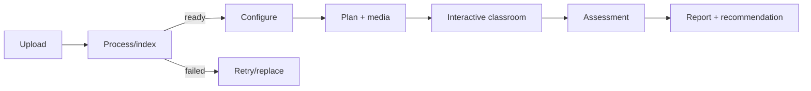
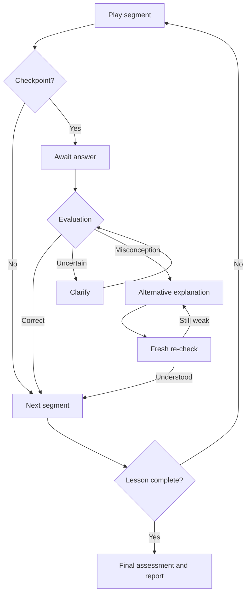

# Application Flow

## Actors and navigation

- **Visitor:** landing, register, login, accessibility/privacy information.
- **Learner:** dashboard, source library, lesson setup, generation progress, classroom/player, report, progress, profile.
- **Administrator:** operational health, job failures, usage and safety metadata; private content is hidden unless an audited support policy permits access.

Primary learner navigation: `Dashboard`, `Learn`, `Library`, `Progress`, `Profile`. During a live lesson, navigation warns before abandonment and preserves resumable progress.

## Route and page registry

| Page | Browser route | Purpose | Key states |
| --- | --- | --- | --- |
| Landing/auth | `/`, `/login`, `/register` | Explain product and establish identity | default, validation, rate-limited |
| Dashboard | `/app` | Resume, recommendations, recent lessons | loading, new learner, populated, error |
| Library | `/app/library` | Upload and manage material | uploading, processing, ready, failed, deleting |
| Lesson setup | `/app/learn/new` | Topic/source, scope, objective, profile overrides | draft, invalid, estimating, submitting |
| Generation | `/app/lessons/:id/preparing` | Plan/media progress and cancellation | queued, staged progress, partial ready, failed |
| Classroom | `/app/sessions/:id` | Synchronized teacher, visuals, transcript, checkpoints | playing, paused, buffering, awaiting response, remediation, offline |
| Report | `/app/sessions/:id/report` | Score, strengths, gaps, citations, next steps | generating, complete, partial/error |
| Progress | `/app/progress` | Mastery, history, learning paths | empty, populated, filtered |
| Profile | `/app/profile` | Defaults, accessibility, language, data deletion | saved, invalid, deleting |
| Operations | `/admin/operations` | Health, jobs, providers, usage/cost, and service overview | healthy, degraded, incident |
| AI providers | `/admin/providers` | Capability routing, approved configurations, evaluations, limits, and fallbacks | evaluating, active, rate-limited, degraded, disabled |

## FLOW-001 — First lesson from uploaded material

**Preconditions:** signed-in learner; rights to process the source.

1. Learner opens Library, chooses a supported file, and sees type/size limits.
2. Client creates a document, uploads to a signed URL, confirms completion, and subscribes to progress.
3. The UI shows scan, parse/OCR, structure, index, and ready stages. Failure shows a safe reason, retry, replace, or delete.
4. Learner selects a ready document/section and chooses `Create lesson`.
5. Setup captures objective, level, language, time, depth, style, and interaction preference with profile defaults.
6. Server validates ownership/scope, creates lesson and planning job, and returns the preparation page.
7. The Master Teaching Orchestrator runs bounded Knowledge, Learner Modeling, Curriculum, Planning, Explanation, Grounding, Quiz, and Media agent workflows. Every candidate artifact is validated before acceptance.
8. Preparation progressively reports learner-friendly stages—plan, script, visuals, voice, avatar, and final checks—rather than exposing internal chain-of-thought. Learner may cancel; avatar failure offers fallback.
9. Learner previews objectives/timing and starts a teaching session.
10. Classroom plays the timeline and pauses at checkpoints.
11. A wrong response invokes Response Analysis, then Adaptation and the minimum explanation/media delta needed for a changed strategy and fresh check.
12. After planned segments, the final assessment runs and the report is generated.
13. Validated observations/inferences update mastery/history and the dashboard offers a reasoned next step.

## FLOW-002 — Topic-only lesson

The learner enters a topic instead of selecting material. Setup and teaching are otherwise the same. The preview labels provenance as general model knowledge and does not display fabricated source citations. If the topic is broad, the learner can accept a multi-session path or narrow the first lesson.

## FLOW-003 — Adaptive checkpoint

1. Playback pauses, focus moves to the question heading, and the prompt is also readable in the transcript.
2. Learner submits one answer; the button disables until acknowledgement. A retry-safe idempotency key prevents duplicates.
3. Deterministic or rubric evaluation runs. The UI shows neutral “Checking your reasoning,” not premature correctness.
4. Correct/high-confidence: concise feedback, optional rationale, then continue.
5. Incorrect with diagnosed misconception: constructive feedback, alternative representation/example, then a new check.
6. Low evaluation confidence: ask one clarification; do not change mastery.
7. Repeated difficulty: simplify, offer a hint, and eventually flag for revision without trapping the learner.
8. Network loss preserves typed text locally; reconnect reconciles authoritative session state.

## FLOW-004 — Follow-up and language switch

- A follow-up pauses playback, includes the current objective/segment and permitted evidence, answers with citations when material-grounded, and offers `Continue lesson`.
- Language switching updates subsequent explanation, questions, captions, and voice. Existing transcript entries remain available in their original language; position, objectives, and attempts do not reset.
- If the selected voice/avatar lacks the language, the UI explains the fallback before continuing.

## FLOW-005 — Resume and recovery

- Dashboard lists resumable sessions at their last committed segment/state.
- On reload/reconnect, REST returns the authoritative session version and event cursor; the client discards impossible local transitions.
- A failed segment can retry independently. Completed segment assets and answers are retained.
- If generation cannot finish, learners can use available transcript/audio/visuals or return to setup without losing the source.

## FLOW-006 — Deletion

Document deletion previews affected lessons/assets. Confirmation immediately hides/revokes the source and queues physical cleanup; active jobs cancel. Account deletion requires re-authentication, explains retention, revokes sessions immediately, and provides status where legally appropriate. Destructive operations cannot be undone through normal UI.

## FLOW-007 — Agent failure, fallback, and audit

1. The orchestrator detects timeout, invalid schema, failed validation, or local runtime/tool error and classifies the specialist as mandatory or optional for the current artifact.
2. One bounded repair or configured compatible implementation may run within the remaining workflow budget.
3. Optional voice/avatar/visual enhancements degrade to an accessible approved artifact. Mandatory planning, grounding, response evaluation, authorization, or state-transition failure pauses safely.
4. The learner sees the affected lesson stage and recovery action, not prompt text, chain-of-thought, provider secrets, or internal debate.
5. Administrators see run graph, agent/contract versions, duration, budget, validation result, fallback, and redacted error under audited access.
6. Retry uses the same workflow/idempotency identity and never duplicates accepted artifacts or session progression.

## FLOW-008 — Provider configuration and approval

1. An administrator registers a server-side provider credential and selects supported capabilities without exposing the secret to the browser or database.
2. The UI shows provider/model version, purpose, license/terms, data boundary, region, retention, rate limits, expected latency/cost, evaluations, and limitations.
3. Contract and quality checks validate schema handling, grounding, language, safety, timeout, rate-limit, and failure behavior using non-sensitive fixtures.
4. A passing configuration is approved and activated for a capability; an independently approved fallback may be assigned.
5. Health, usage, cost, errors, and rate limits remain visible. Disabling a configuration prevents new calls without erasing trace history.
6. Provider failover preserves lesson state and never silently changes source scope, language, rubric, or teaching policy.

## Classroom behavior

Seek is allowed across completed content. Skipping an unanswered checkpoint requires explicit confirmation and records it as skipped. Playback rate, volume, captions, transcript, and reduced-motion/audio-only settings persist in the profile.

## Error and authorization behavior

| Condition | User behavior |
| --- | --- |
| 400/validation | Keep safe input; show field-level correction and summary. |
| 401 | Preserve intended destination and draft locally; sign in then resume. |
| 403/404 | Do not reveal whether another user's resource exists; offer safe navigation. |
| 409 | Refresh authoritative session/job state and explain the conflict. |
| 413/415 | Explain size/type limits before retry. |
| 429 | Show retry timing and avoid duplicate submission. |
| Provider timeout, outage, or rate limit | Show delayed/degraded state; use approved fallback, retry, or cancel while preserving completed work. |
| Provider missing/misconfigured | Link to provider setup; do not expose credentials or bypass the approved capability route. |
| 500 | Stable error ID, retry when safe, no stack/provider details. |

## Flow acceptance

Every async view remains navigable and announces progress without requiring continuous polling by the learner. Browser back/refresh must not duplicate uploads, plans, responses, or reports. All empty/error states provide a useful next action. Cross-tenant identifiers produce the same safe not-found experience.
