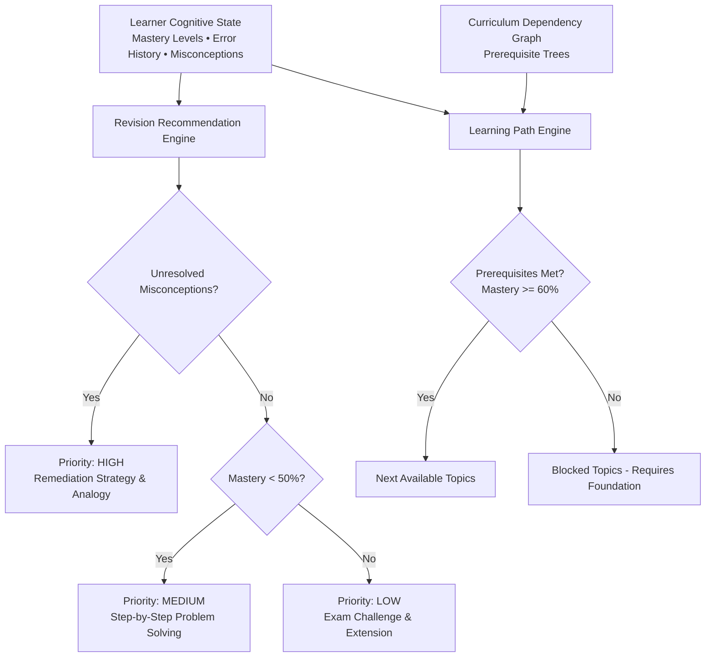
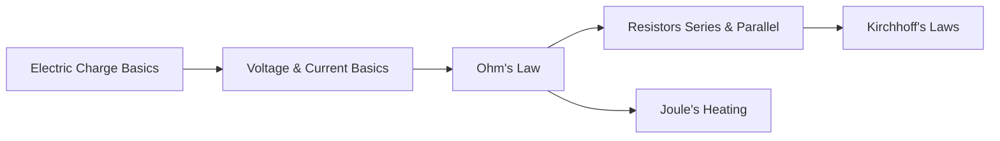

# Recommendation & Curriculum Path Engine

**Module Owner:** Member 4  
**Namespace:** `app.analytics.recommendations` / `app.analytics.learning_path`  
**Status:** 🟢 Production Hardened & Verified  

---

## 1. Overview
The Recommendation & Curriculum Path Engine is responsible for dynamically generating personalized learning recommendations and intelligent curriculum roadmaps. It prioritizes targeted interventions to remediate cognitive flaws and schedules high-yield revision routines before introducing advanced concepts.

---

## 2. Recommendation Prioritization Algorithm

The `RevisionRecommendationEngine` operates on a three-tier prioritization model:

### Tier 1: HIGH Priority (Misconception Remediation)
- **Trigger:** Active or recurring misconception ($\text{frequency} \ge 2$ or $\text{resolved} = \text{False}$).
- **Action:** Schedules focused 10-minute remediation utilizing `SIMPLE_ANALOGY` or visual reframing.
- **Goal:** Neutralize flawed mental models before they propagate to dependent concepts.

### Tier 2: MEDIUM Priority (Developing Mastery)
- **Trigger:** Concept mastery score $< 0.50$ without diagnosed structural misconceptions.
- **Action:** Schedules 8-minute deliberate practice sessions with `STEP_BY_STEP` worked examples.
- **Goal:** Build foundational computational and conceptual confidence.

### Tier 3: LOW Priority (Proficiency & Extension)
- **Trigger:** High concept mastery ($\ge 0.70$).
- **Action:** Schedules 5-minute timed challenge questions using `DIRECT_EXPLANATION` and exam-style synthesis.
- **Goal:** Long-term retention via spaced retrieval practice.

---

## 3. Prerequisite-Aware Curriculum Graphs

Curriculum paths are modeled as directed acyclic graphs (DAGs) where edges represent strict mastery prerequisites:

### Example: Physics Electromagnetism Track

### Mastery Gating Rule
A target concept $C$ is unlocked for learning **if and only if**:
$$\forall P \in \text{Prerequisites}(C), \quad \text{Mastery}(P) \ge 0.60$$

If any prerequisite $P$ has $\text{Mastery}(P) < 0.60$, concept $C$ is placed in `blocked_topics` and the student is guided back to $P$.

---

## 4. REST API Endpoints

- `POST /api/v1/recommendations/generate`
  - Body: `{"learner_id": "student_001"}`
  - Returns: Ordered list of `RevisionRecommendation` objects with priority, rationale, recommended duration, and strategy.

- `GET /api/v1/analytics/<learner_id>/learning-path?subject=physics`
  - Returns: `LearningPath` containing `current_topic`, `completed_topics`, `next_topics`, and `blocked_topics`.
