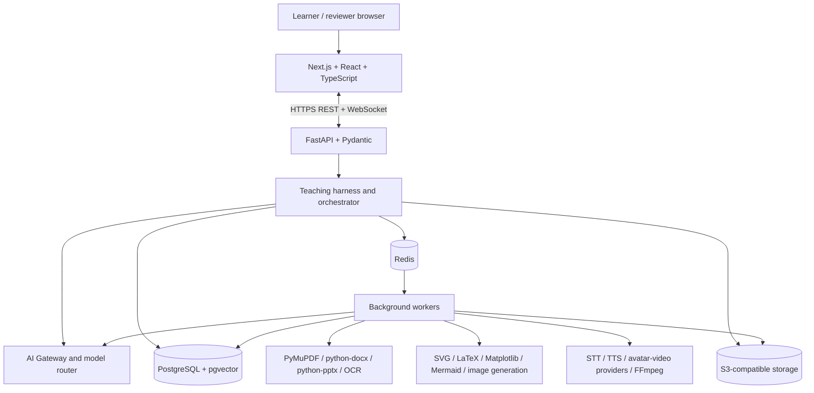
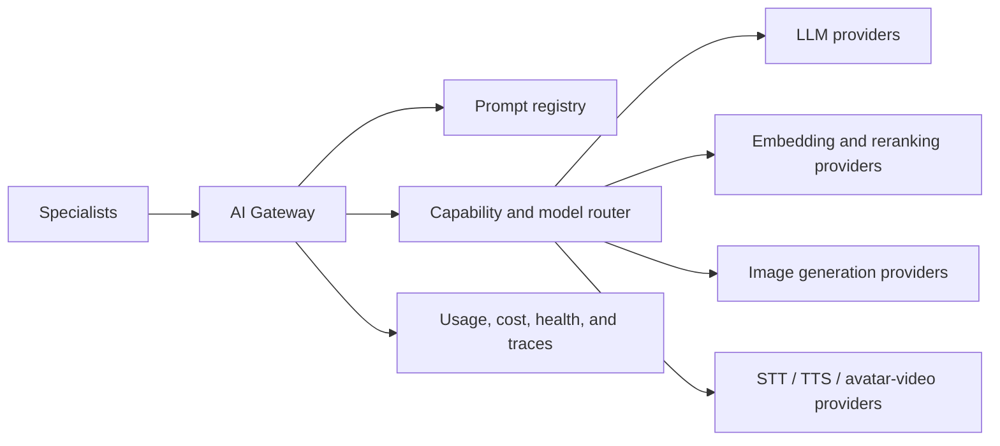
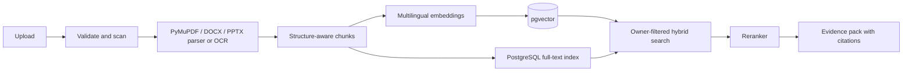
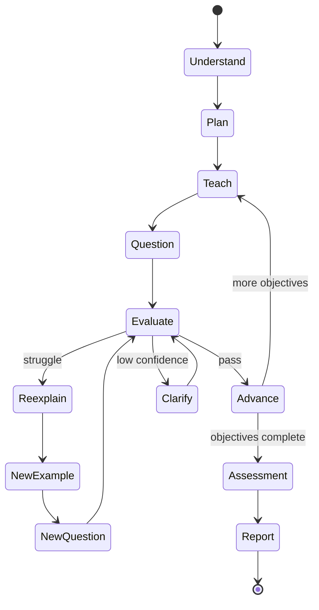

# AI Teacher Architecture

## Status and approach

This target architecture implements the approved stack in `technology_stack.md`. All components remain `PLANNED` until `../execution/features.md` records working, tested behavior. The system begins as a modular FastAPI application with a Next.js frontend and separately scalable background workers.

The primary architectural rule is to separate probabilistic generation from deterministic control:

```text
AI or media provider -> structured output -> validator -> teaching policy
                     -> state machine -> tool action -> cognitive update
```

## System context



PostgreSQL is the system of record for identity, teaching state, learner cognition, history, traces, and recommendations. pgvector and PostgreSQL full-text search support hybrid retrieval without a second database. Redis holds cache, ephemeral coordination, and job state; durable business state never depends on Redis. Object storage holds uploads and generated media.

## Code boundaries

```text
backend/
  api/             FastAPI routes, WebSocket handlers, request/response schemas
  domain/          entities, policies, state machines, mastery rules
  services/        use cases and transaction boundaries
  repositories/    PostgreSQL ports and adapters
  agents/          typed specialist contracts and validators
  orchestration/   workflow graph, routing, budgets, artifact acceptance
  ai/              gateway, model router, prompts, structured outputs, safety
  ingestion/       parsers, OCR, normalization, chunking, indexing
  teaching/        planner, session runtime, adaptation, assessment
  media/           scene planning, visuals, voice, avatar, FFmpeg composition
  workers/         idempotent background tasks
  integrations/    provider, Redis, storage, and third-party adapters
  observability/   logs, metrics, traces, audits, usage and cost
frontend/
  app/              Next.js routes and layouts
  features/         auth, library, setup, lesson, assessment, progress
  components/       accessible reusable UI primitives
tests/              unit, integration, contract, end-to-end, AI evaluation
```

Routes translate protocols. Services coordinate use cases. Domain code owns rules. Repositories and adapters isolate infrastructure. Provider SDK types and credentials never enter domain models.

## Controlled specialist engine

The Master Teaching Orchestrator is deterministic application code backed by a finite state machine. Specialists provide bounded capabilities for ingestion, retrieval, grounding, learner modeling, curriculum, planning, explanation, examples, questions, response analysis, adaptation, reporting, visual planning/rendering, voice, avatar, composition, and accessibility.

Every specialist conforms to a typed `AgentPort<Input, Output>` and communicates only through the orchestrator. It receives purpose-minimized references, cannot persist domain state, and returns an immutable candidate artifact. Schema, ownership, evidence, safety, budget, and transition validators must accept the artifact before an authorized service stores it or advances the session.

Specialists initially execute in-process or in background workers. An authenticated remote adapter may be introduced only for measured scaling, dependency isolation, or ownership needs without changing domain contracts.

## AI Gateway and model routing



The gateway is the only entry point for model-backed work. It owns capability routing, provider selection, authentication, deadlines, bounded retry, rate/concurrency limits, circuit breaking, normalized errors, streaming, usage/cost capture, and approved fallbacks. Providers and models are selected by configuration and evaluation, not embedded in domain code.

Pydantic schemas constrain model output. The harness also checks evidence coverage, permissions, safety, teaching policy, and state-machine legality. A fallback may not silently alter source scope, objective, language, rubric, or safety policy.

## Document ingestion and RAG



Parsers preserve document, chapter, section, page/slide, heading, and table context. OCR is an adapter supporting Tesseract or an approved cloud service. Retrieval combines semantic and keyword candidates, applies ownership and scope filters, reranks results, and returns bounded evidence packs. Uploaded instructions are untrusted data and cannot modify policies or system prompts.

## Cognitive engine and teaching state

The learner model explicitly stores profile preferences, observable attempts, concept mastery, confidence-scored misconceptions, session memory, long-term history, and prerequisite relationships. Observations remain separate from AI inferences so learners can inspect, correct, expire, or delete inferred traits.



Each transition uses optimistic concurrency and an append-only event/audit record. Only the orchestrator authorizes state changes.

## Visual and media pipeline

A versioned `SceneSpec` describes semantics, layout, timing, accessibility, and provenance independently of renderer. Equations use LaTeX, graphs use Matplotlib, flows use Mermaid, technical diagrams use SVG/programmatic drawing, code uses an editor/highlighter component, and illustrative content may use an image-generation provider.

Teacher scripts pass through multilingual TTS and then the avatar/video adapter. Student microphone input passes through STT, while typed answers remain a required fallback. FFmpeg normalizes audio, converts formats, prepares captions, and composes short segments. Short generation units allow the lesson to pause at checkpoints and adapt before producing the next segment. A provider failure degrades to available narration, captions, transcript, and visuals rather than losing lesson state.

## API and events

REST endpoints are versioned under `/api/v1`. Representative resources include authentication/profile, documents, sections, jobs, retrieval, lessons, sessions, responses, reports, progress, and recommendations. Long operations return `202 Accepted` with job/resource identifiers.

WebSockets publish ordered, resumable events such as `lesson_started`, `segment_ready`, `question_ready`, `student_answer_received`, `evaluation_ready`, `adaptation_selected`, `next_segment_ready`, and `assessment_complete`. REST snapshots reconcile state after reconnect. Events carry identifiers and state changes, not private source bodies or provider credentials.

## Jobs and consistency

Redis-backed queues separate ingestion, AI, and media workloads. Jobs have stable idempotency keys, heartbeat, attempt counts, deadlines, bounded retry/backoff, cancellation, and dead-letter state. Transactional database updates and outbox events commit atomically. Workers may propose artifacts but call the same authorized service layer for persistence.

## Security and privacy

- Use secure sessions or JWT with rotation, CSRF protection where applicable, rate limits, and re-authentication for destructive operations.
- Apply owner/tenant predicates to every query, cache key, object key, job, and event subscription.
- Keep provider and storage credentials server-side in environment/secret management.
- Minimize content sent to each external provider and document consent, retention, deletion, residency, subprocessors, and limitations.
- Use signed short-lived object URLs, malware/type/size checks, encryption in transit/at rest, and redacted logs.
- Treat model output, uploaded content, filenames, OCR text, and provider callbacks as untrusted input.

## Observability and quality

Structured JSON events include trace, workflow, session, actor/resource, state, concept, retrieval query and chunk IDs, provider/model, prompt/schema version, policy decision, evaluation score, misconception, next action, latency, usage/cost, job state, and fallback. Sensitive content and secrets are excluded by default. OpenTelemetry connects browser, FastAPI, WebSocket, queue, database, retrieval, storage, and provider calls.

Quality gates include pytest unit/integration tests, agent/provider contract tests, RAG and grounding evaluations, teaching-policy/state-machine tests, multilingual and misconception corpora, frontend component tests, Playwright acceptance paths, accessibility checks, migration checks, upload/security tests, and provider-failure drills.

## Deployment

Docker packages the Next.js application, FastAPI API, and worker processes. Local development uses Docker Compose with PostgreSQL/pgvector, Redis, and S3-compatible storage. The initial cloud profile uses managed equivalents and GitHub Actions; Kubernetes and service-per-agent deployment are explicitly deferred until evidence justifies them.
