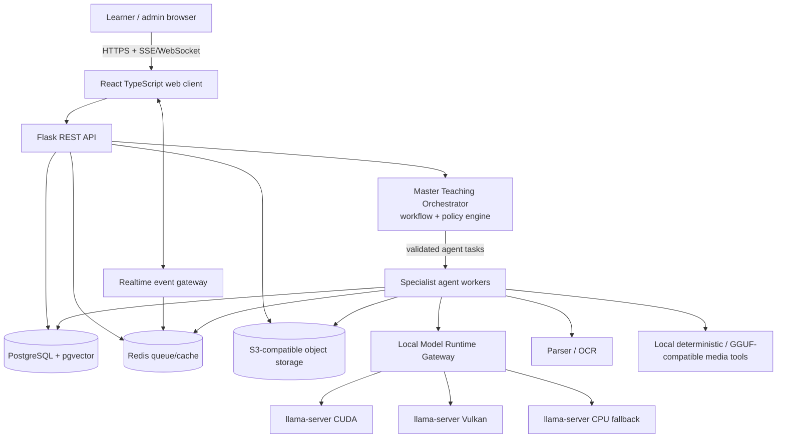
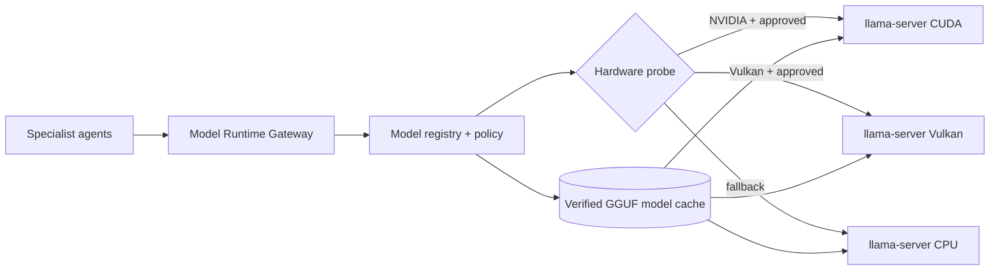
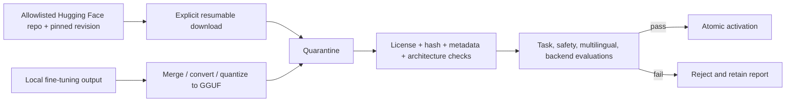
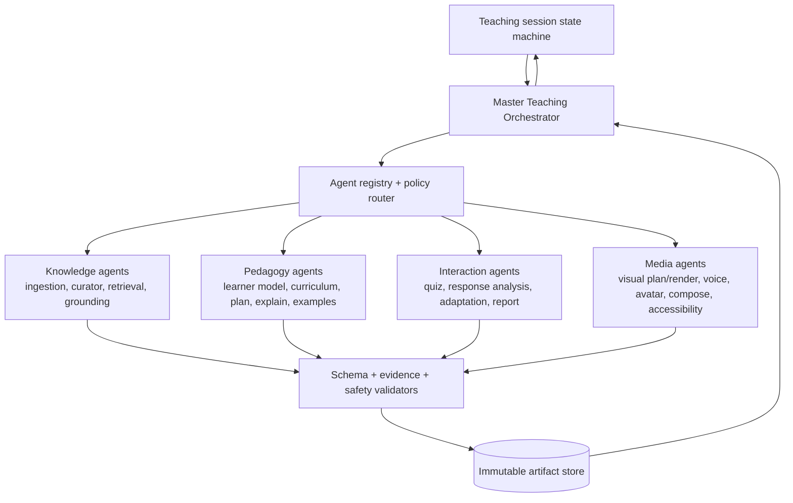
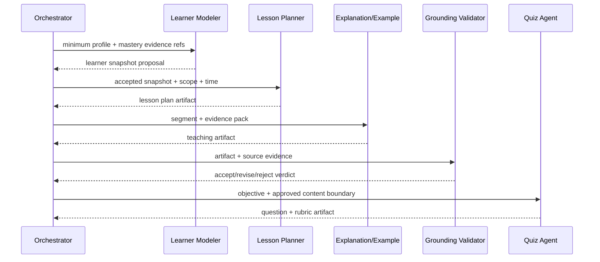
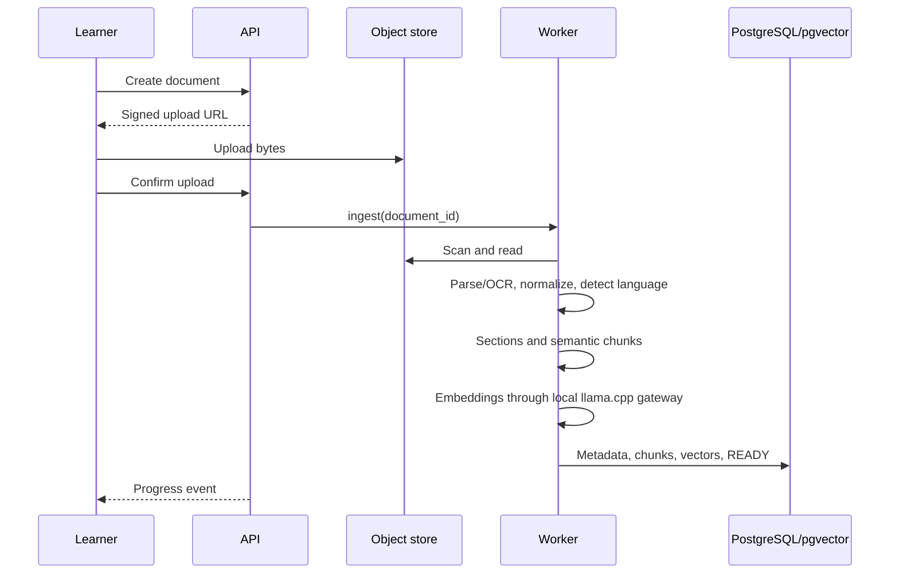
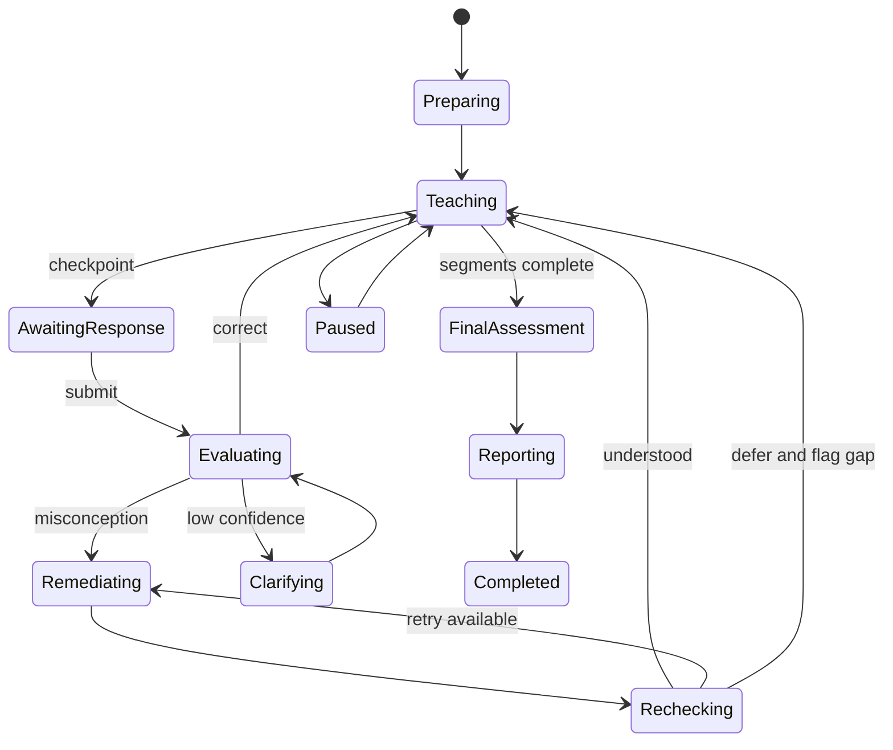

# AI Teacher Architecture

## Status and approach

This is the target architecture. No application code exists as of 2026-08-31, so all components are `PLANNED`. A controlled multi-agent engine lives inside a modular Flask application with asynchronous workers. Logical agent boundaries are strict from day one; physical services are split only when scale, isolation, or ownership justifies them.

## System context and containers



PostgreSQL is selected over the generic template's SQLite/MongoDB alternatives because relational ownership, teaching-state transactions, concurrent workers, migrations, full-text search, and pgvector are required together. Local development uses PostgreSQL/pgvector, Redis, and MinIO via containers.

All neural inference is local. Specialist agents use approved GGUF artifacts through `llama.cpp`; the application has no hosted inference adapter or silent cloud fallback.

## Code boundaries

```text
app/
  api/             controllers, request/response schemas, authorization
  domain/          entities, policies, state machines, mastery rules
  services/        use cases and transaction boundaries
  repositories/    persistence ports and PostgreSQL adapters
  agents/          contracts, registry, specialists, validators
  orchestration/   workflow graph, routing, budgets, artifact acceptance
  ai/              prompts, structured outputs, safety, local runtime ports
  ingestion/       parsers, OCR, normalization, chunking, indexing
  teaching/        planner, runtime, adaptation, assessment
  media/           scene planning, visuals, TTS/avatar, composition
  workers/         idempotent background tasks
  model_runtime/    llama.cpp gateway, model registry, hardware/backend policy
  integrations/    local storage, parser, and media-tool adapters
  observability/   logs, metrics, traces, audit
frontend/src/
  features/        auth, library, setup, lesson, assessment, progress
  components/      accessible reusable UI primitives
tests/             unit, integration, contract, e2e, AI evaluation
```

Controllers only translate HTTP. Services coordinate use cases. Domain code owns rules. Repositories and runtime adapters isolate infrastructure. Workers call the same service layer. `llama.cpp`, GGUF, CUDA, and Vulkan types never enter domain models.

## Local Model Runtime Gateway



The gateway is the only model-inference client. It provides task-to-model routing, local server discovery, health, admission control, model residency, shared instances, batching, parallel slots, context/KV-cache budgets, GPU-layer offload, warmup, cancellation, and metrics. Logical agents share resident models instead of loading one copy per specialization.

Backend selection is policy-driven:

1. Detect OS, CPU ISA, memory, GPU devices, drivers, Vulkan capabilities, and NVIDIA CUDA compatibility.
2. Match hardware to an approved model/runtime profile with measured VRAM/RAM, context, concurrency, and latency limits.
3. Prefer CUDA for supported NVIDIA devices. Select Vulkan for validated Vulkan devices, including the tested Intel Arc/iGPU matrix. Use CPU when acceleration is unavailable or fails validation.
4. Start a pinned `llama-server` build on loopback/private IPC, load the verified GGUF, run backend operation checks and a known-answer smoke inference, then advertise readiness.
5. Fall back only to another approved local backend or smaller approved model. Never send work to the internet.

CUDA and Vulkan are separate build/runtime artifacts and are tested independently. Vulkan capability does not imply that every model, quantization, context size, or Intel device meets interactive latency; the hardware matrix is evidence-based.

### Model-to-agent routing

An agent definition names a capability profile, such as `teaching-reasoning`, `multilingual-explanation`, `embedding`, or `reranking`, rather than a filename. The model registry resolves it to an approved manifest and compatible local backend. Several agents may share one instruction model with different prompts/grammars; a specialized model is added only when evaluation demonstrates value.

`llama-server` provides generation, embeddings, reranking, grammar/schema-constrained output, parallel decoding, and supported multimodal capabilities when the pinned build/model permits them. The orchestrator, not `llama-server`, owns agent loops and tool execution.

### Model acquisition and activation



The manifest records repository, immutable revision, filename, license, SHA-256, base model, task, architecture, quantization, context, chat template, tokenizer metadata, expected memory, `llama.cpp` build compatibility, evaluation suite/version, and approval. Downloads never use arbitrary model URLs and never activate partial files. Offline import follows identical gates.

Users or administrators explicitly approve a download after seeing size, source, revision, license, disk/RAM/VRAM estimate, and target agents. Once provisioned, inference workers operate with outbound network denied.

### Local fine-tuning lifecycle

```text
approved base + licensed/consented versioned dataset
-> clean/split/deduplicate/redact
-> reproducible local training, typically an adapter/LoRA
-> task and safety evaluation
-> merge if required
-> convert and quantize to GGUF
-> CUDA/Vulkan/CPU regression evaluation
-> model card + manifest + checksum
-> registry approval
```

Training tooling may use a framework suited to fine-tuning; the production artifact must be supported GGUF and inference runs only through `llama.cpp`. Retain training-data lineage, licenses/consents, recipe, seed, hyperparameters, code revision, base/adapter/merged digests, metrics, and limitations. Failed models never enter the serving cache.

### Voice and video feasibility boundary

`llama.cpp` does not generically execute arbitrary TTS, diffusion, lip-sync, or video architectures. Therefore:

- a neural voice/avatar/visual model is allowed only if the pinned `llama.cpp` version supports its architecture and it passes GGUF/backend evaluations;
- deterministic local tools may synthesize, render, and compose media because they are not neural model inference;
- exact educational visuals use KaTeX, Mermaid, plotting, Graphviz, code renderers, SVG/canvas, and FFmpeg composition;
- when no compatible local neural voice/avatar exists, the product exposes transcript/captions, deterministic voice or non-neural avatar animation where available, and a documented degraded mode instead of adding another model runtime.

This may reduce photorealistic media quality, but it preserves the strict local, single-runtime guarantee.

## Multi-agent teaching engine



### Master Teaching Orchestrator

The master is a durable orchestration service, not a single all-knowing LLM. A deterministic workflow graph controls eligible tasks and teaching-state transitions. A bounded routing policy may select among compatible specialists, but cannot invent agent types, bypass validators, or exceed hop/deadline/cost limits.

It is responsible for:

- resolving the next eligible specialist from workflow state;
- issuing least-privilege context references rather than database snapshots;
- enforcing deadlines, budgets, cancellation, idempotency, and maximum attempts;
- validating artifact schema, evidence, safety, ownership, and domain invariants;
- accepting/rejecting candidate artifacts and authorizing persistence through services;
- applying fallback policy and recording complete provenance;
- emitting UI progress without exposing internal chain-of-thought or private context.

Specialists never call one another directly. They return an artifact to the orchestrator, which evaluates workflow state and creates the next task. This hub-and-spoke rule prevents circular conversations and makes every decision replayable.

### Specialist responsibilities

| Agent | Bounded responsibility | Does not own |
| --- | --- | --- |
| Ingestion | Extract/OCR/normalize source structure | lesson content or persistence policy |
| Knowledge Curator | Identify concepts, definitions, examples, prerequisites | final retrieval ranking |
| Retrieval | Return owner-filtered evidence packs | teaching claims |
| Grounding/Fact Check | Verify claims and citations against evidence | rewrite workflow authority |
| Learner Modeler | Propose evidence-backed learner snapshot/inferences | direct profile/database writes |
| Curriculum | Produce prerequisite graph and learning path | segment narration |
| Lesson Planner | Produce timed objective/segment plan | teaching-state transitions |
| Explanation | Create grounded, level/language-aware explanations | plan or assessment policy |
| Example | Create analogy/worked/application examples | response grading |
| Quiz | Create objective-mapped questions, answer specs, rubrics | grade learner attempts |
| Response Analyst | Evaluate response and identify misconception/confidence | change mastery directly |
| Adaptation | Propose changed remediation strategy and re-check needs | authorize progression |
| Report/Recommendation | Summarize verified outcomes and next actions | fabricate evidence |
| Visual Planner | Select subject-appropriate representation and SceneSpec | binary rendering |
| Visual Renderer | Render exact/generated visual asset | lesson semantics |
| Voice | Produce localized narration/audio/timing | text correctness |
| Avatar | Produce presenter/lip-sync asset | narration content |
| Composer | Synchronize approved assets into timeline | regenerate pedagogy |
| Accessibility | Produce/validate captions, transcript, alt descriptions | waive accessibility gates |

Some specialists are deterministic or hybrid services. For example, MCQ/numeric grading, KaTeX rendering, caption format validation, and policy enforcement should not become LLM calls merely to appear “agentic.”

### Agent contract and artifact protocol

All implementations conform to a typed `AgentPort<Input, Output>`. Deployment adapters support an in-process call, Celery task, or authenticated remote API without changing domain schemas.

```json
{
  "task_id": "uuid",
  "workflow_id": "uuid",
  "agent": {"type": "response_analyst", "version": "1.0"},
  "contract": {"input": "response-evaluation/1.0", "output": "evaluation/1.0"},
  "context_refs": ["response:uuid", "question:uuid", "objective:uuid"],
  "constraints": {"language": "hi-IN", "deadline_ms": 8000, "token_budget": 2500},
  "idempotency_key": "opaque",
  "trace_id": "uuid"
}
```

```json
{
  "task_id": "uuid",
  "status": "succeeded",
  "artifact": {"type": "evaluation", "schema_version": "1.0", "ref": "artifact:uuid"},
  "confidence": 0.86,
  "evidence_refs": ["response:uuid", "rubric:uuid"],
  "provenance": {"implementation": "llm-rubric", "model": "deployment-alias"},
  "warnings": []
}
```

Task messages contain references and constraints, not arbitrary database access. A context broker/service resolves only authorized projections for the declared agent purpose. Results are immutable candidate artifacts. The owning domain service performs the final validated write.

### Workflow examples



During an interactive checkpoint, only the deterministic grader or Response Analyst runs first. The Adaptation Agent runs only on misconception/low mastery; a new Explanation/Example and optional media delta are then generated. This minimizes latency and cost.

### Failure and conflict policy

- Schema-invalid output gets at most one bounded repair by the same implementation, then fallback or failure.
- A grounding rejection returns explicit claim/evidence defects; the orchestrator may request one revision without exposing hidden reasoning.
- Conflicting agents do not vote freely. Authority is predetermined: retrieval owns evidence selection, grounding owns citation verdict, planner owns timing, response analysis owns proposed interpretation, and the state machine owns progression.
- Optional media failure degrades. Mandatory plan/evaluation/authorization failures stop safely and preserve resumable state.
- No workflow can exceed configured hops, retries, wall-clock deadline, or monetary budget.

### Learner-model privacy boundary

The Learner Modeler consumes authorized facts and returns a proposal:

```text
append-only attempts/history -> purpose-scoped projection -> Learner Modeler
-> observation/inference proposal -> privacy/policy/schema validation
-> Learner Profile Service -> PostgreSQL
```

Observations and inferences are separate. Inferences include confidence, supporting response IDs, version, creation/expiry, and review status. Agents cannot create medical, psychological, demographic, or other sensitive diagnoses. Learners can inspect/correct/delete personalization data, and low-confidence conclusions do not affect mastery.

## Document ingestion and RAG



Retrieval applies owner and selected-source filters before hybrid vector/full-text search, expands adjacent chunks, reranks, deduplicates, and returns a bounded evidence pack. Evidence retains document, section, page/slide, offsets, and checksum. Uploaded text is untrusted evidence: embedded instructions cannot override policy. Topic-only lessons use model knowledge labeled `general_knowledge`, never fake citations.

## Lesson planning and media

1. Build a learner snapshot from profile and concept mastery.
2. Resolve topic/source scope and retrieve structure/evidence.
3. Reserve time for introduction, checkpoints, remediation, and final assessment.
4. Generate schema-constrained objectives, prerequisites, segments, timings, examples, visuals, and questions.
5. Validate duration, citations, objective coverage, difficulty, and language.
6. Produce narration and a runtime-neutral `SceneSpec` per segment.
7. Prefer deterministic visuals: KaTeX, plots, Mermaid, syntax-highlighted code, timelines, and labeled diagrams; use generated imagery only when helpful and moderated.
8. Generate compatible local voice/avatar output or deterministic fallback, timed captions, thumbnails, and a timeline manifest asynchronously.

Segmented timeline playback is primary because it can pause for interaction. MP4 export is optional. If the avatar fails, narration, captions, visuals, and transcript remain usable.

## Adaptive teaching runtime



Deterministic graders handle MCQ and numeric answers; a rubric-constrained LLM handles free text. Evaluation returns correctness, confidence, cited/rubric evidence, misconception, feedback, and action. Low confidence asks clarification and does not change mastery. Remediation must change an analogy, representation, worked example, granularity, or language and use a fresh re-check.

Each attempt yields evidence from correctness, difficulty, hints, recency, and confidence. A bounded exponential update produces rebuildable concept mastery. Recommendations prioritize weak prerequisites, unmet objectives, and spaced review.

## API contract

Endpoints are JSON and versioned under `/api/v1`.

| Area | Representative endpoints |
| --- | --- |
| Auth/profile | `POST /auth/register`, `POST /auth/login`, `GET/PATCH /me` |
| Documents | `POST /documents`, `POST /documents/{id}/complete-upload`, `GET/DELETE /documents/{id}` |
| Lessons | `POST /lessons`, `GET /lessons/{id}`, `POST /lessons/{id}/generate` |
| Sessions | `POST /lessons/{id}/sessions`, `GET /sessions/{id}`, `POST /sessions/{id}/responses`, `POST /sessions/{id}/questions` |
| Playback | `GET /sessions/{id}/timeline`, `POST /sessions/{id}/pause`, `POST /sessions/{id}/resume` |
| Progress | `GET /sessions/{id}/report`, `GET /me/progress`, `GET /me/recommendations` |
| Async | `GET /jobs/{id}`, `GET /events` (SSE), optional `/ws` |

Mutations accept idempotency keys; errors use RFC 9457 problem details; lists use cursor pagination. Every resource lookup performs server-side ownership checks.

## Data and consistency

- PostgreSQL is authoritative; Redis is disposable; object storage holds immutable binaries identified by key and checksum.
- A transaction writes state plus an outbox event. Workers claim idempotently so queue/database dual writes do not lose work.
- Optimistic `version` fields reject concurrent session responses.
- Object access uses short-lived signed URLs.
- Deletion revokes access immediately, then a job deletes objects and records under retention rules.
- Agent tasks and results are immutable/auditable. Accepted artifacts reference the run that produced them; rejected candidates do not mutate domain state.

See `backend_schema.md` for the planned data contract.

## Security and safety

- Secure HTTP-only cookies, Argon2id hashes, CSRF, TLS, rate limits, least privilege, encrypted secrets.
- MIME sniffing, file/page/size limits, archive-bomb defense, malware scanning, and isolated parsing.
- Tenant predicates and cross-owner integration tests prevent IDOR.
- Policy, application data, user input, and retrieved evidence use distinct prompt roles. Structured output is validated and HTML sanitized.
- Moderate prompts and generated media requests; apply age-appropriate teaching behavior.
- Logs contain identifiers, timing, usage, and error class—not source text or full answers by default.

## Reliability, observability, and cost

Jobs have stable idempotency keys, heartbeat, attempt count, timeout, cancellation, bounded backoff, and dead-letter status. Local model/runtime calls use timeouts, health gates, concurrency/admission limits, and approved local fallback profiles. Trace context crosses request, job, and runtime boundaries.

Measure queue age, ingestion and first-media latency, retrieval quality, citation coverage, completion, adaptation/re-check rates, evaluator disagreement, provider errors, token/media consumption, and cost. Per-agent dashboards add contract failures, rejection/repair rate, confidence, fallback rate, orchestration hops, and latency/cost by agent version. Cache embeddings by checksum and media by normalized request/model version, never sharing private source-derived output across owners. Enforce workflow, token, size, job, duration, and avatar-minute quotas.

## Deployment

```text
CDN/WAF -> load balancer -> API/realtime replicas
                             |-> PostgreSQL + pgvector
                             |-> Redis
                             |-> ingestion / AI / media worker pools
                             |-> S3-compatible storage
```

Separate queues stop long avatar jobs from starving interactive evaluation. Deploy immutable containers, apply forward-only migrations before traffic, and use readiness/liveness probes. Development uses Docker Compose; production uses environment configuration and a secret manager.

### Modular deployment evolution

| Profile | Communication | Intended use |
| --- | --- | --- |
| In-process | Typed function call through `AgentPort` | Fast deterministic validators/renderers and local tests |
| Worker | Durable Celery message through the same envelope | Default for LLM, ingestion, evaluation, and media workloads |
| Remote specialist | Authenticated mTLS/OAuth service API or durable broker IPC | GPU isolation, incompatible dependencies, independent scaling/team ownership |

The registry selects an adapter by configuration; workflows do not branch on deployment type. Remote messages carry opaque resource references, short-lived capability tokens, nonce/idempotency identity, schema version, and trace context. Services authorize every context fetch. No specialist is split into a network service solely for conceptual purity.

The orchestrator may itself move to a durable workflow platform if measurements show Celery-based recovery/versioning is insufficient. Its domain-facing workflow and agent contracts remain unchanged.

### Operational API surface

Agent endpoints are never public learner APIs. Internal workers use authenticated IPC. Restricted administrative APIs may expose:

- workflow status and redacted run graph;
- agent definition/version and canary status;
- artifact validation outcome and lineage;
- latency, failure, fallback, token, and cost aggregates;
- cancel/retry actions guarded by role, state, and idempotency.

Raw prompts, chain-of-thought, secrets, database credentials, and unrestricted learner context are not exposed through these endpoints.

## Verification strategy

- Unit: timing, state transitions, mastery, auth, chunking, deterministic graders.
- Integration: repositories, outbox, Redis, object storage, parsing, API transactions.
- Runtime/model contracts: synthetic responses, backend probes, GGUF load failures, and schema failures.
- Agent conformance: every implementation passes contract, context-minimization, timeout, idempotency, provenance, and failure-mode tests.
- Orchestration: workflow graph, loop/hop/budget bounds, artifact rejection, fallback, cancellation, and deterministic replay tests.
- RAG evaluation: recall, precision, citation validity, and faithfulness on a versioned corpus.
- Teaching evaluation: correctness, level/language fit, adaptation diversity, and question coverage.
- E2E: PRD acceptance scenarios, CUDA/Vulkan/CPU local fallback, blocked egress, deletion, and cross-tenant denial.
- Load, OWASP/upload fuzzing, keyboard/screen-reader, and reduced-motion checks.

## Invariants

1. The state machine—not free-form model output—controls progression.
2. Source-grounded claims trace to owned chunks.
3. Model output crossing a trust boundary is schema-validated.
4. Media failure cannot destroy lesson content or progress.
5. Background work is idempotent and resumable.
6. Planned and implemented behavior are never conflated.
7. Agents communicate through the orchestrator, never through ungoverned peer conversations.
8. Agents propose immutable artifacts; authorized domain services own state changes.
9. Logical agent modularity does not require premature microservice deployment.
