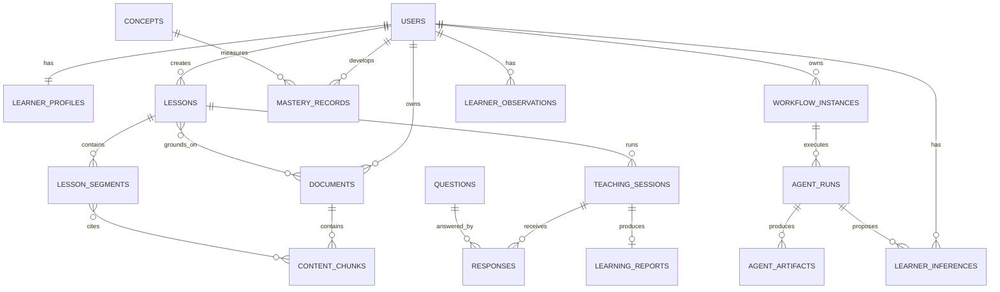

# Backend Schema

## Status and conventions

This is the `PLANNED` PostgreSQL 16 + pgvector schema. It becomes `ACTIVE` only after matching migrations and tests exist.

- Public IDs: UUIDv7; internal provider IDs are never public identifiers.
- Time: `timestamptz` UTC; mutable records have `created_at`, `updated_at`, and optionally `version`.
- Ownership: user-owned roots include `user_id`; dependent access is checked through the root in every repository query.
- Flexible AI structures use validated `jsonb` with a `schema_version`; important query/relationship fields stay relational.
- Binary source/media data lives in object storage; rows store key, checksum, MIME type, size, and provenance.
- Embeddings use `vector(d)` where `d` is deployment-configured and tied to `embedding_model`/version; model changes build a new index rather than mix dimensions.

## Entity registry

| ID | Table | Purpose |
| --- | --- | --- |
| E-001 | `users` | Identity and account lifecycle |
| E-002 | `learner_profiles` | Personalization preferences |
| E-003 | `documents` | Uploaded source and ingestion state |
| E-004 | `document_sections` | Source hierarchy and location |
| E-005 | `content_chunks` | Retrievable text, provenance, and vector |
| E-006 | `concepts` | Canonical or lesson-scoped concepts |
| E-007 | `learning_paths` | Broad goal and ordered milestones |
| E-008 | `learning_path_items` | Topic/lesson steps in a path |
| E-009 | `lessons` | Requested lesson and generation state |
| E-010 | `lesson_objectives` | Assessable objectives |
| E-011 | `lesson_segments` | Ordered teaching/checkpoint units |
| E-012 | `segment_sources` | Segment-to-chunk citations |
| E-013 | `media_assets` | Voice/avatar/visual/caption artifacts |
| E-014 | `teaching_sessions` | Runtime state and position |
| E-015 | `questions` | Versioned checkpoint/final questions |
| E-016 | `responses` | Learner attempts and evaluation |
| E-017 | `mastery_records` | Current per-user concept snapshot |
| E-018 | `learning_reports` | Final session outcome and recommendations |
| E-019 | `jobs` | Durable background-work state |
| E-020 | `outbox_events` | Transactional delivery to queues/events |
| E-021 | `audit_events` | Security and material AI decision audit |
| E-022 | `agent_definitions` | Registered specialist contract/capabilities |
| E-023 | `agent_runs` | Immutable invocation, budget, outcome, and provenance |
| E-024 | `agent_artifacts` | Versioned candidate/accepted specialist outputs |
| E-025 | `learner_observations` | Verified facts derived from attempts/history |
| E-026 | `learner_inferences` | Confidence-scored personalization proposals |
| E-027 | `workflow_instances` | Durable master-orchestrator execution state |
| E-028 | `model_manifests` | Approved GGUF identity, lineage, license, and compatibility |
| E-029 | `runtime_profiles` | CUDA/Vulkan/CPU build and hardware policy |
| E-030 | `model_evaluations` | Quality, safety, language, and backend benchmark results |

## Core tables

### `users` and `learner_profiles`

| Table | Key fields and constraints |
| --- | --- |
| `users` | `id uuid PK`, `email citext UNIQUE NOT NULL`, `password_hash text NOT NULL`, `role text CHECK learner/admin`, `status text CHECK active/disabled/deleting`, `created_at`, `updated_at`, `deleted_at` |
| `learner_profiles` | `user_id uuid PK/FK users ON DELETE CASCADE`, `display_name`, `education_level`, `default_language varchar(35)`, `preferred_style`, `default_time_minutes CHECK >0`, `depth CHECK beginner/intermediate/advanced`, `accessibility jsonb`, `goals jsonb`, timestamps |

Password hashes and email are sensitive and never logged. Account deletion changes status immediately, revokes sessions, then performs retention-aware cleanup.

### Source corpus

| Table | Key fields and constraints |
| --- | --- |
| `documents` | `id`, `user_id FK`, `title`, `original_filename`, `mime_type`, `byte_size`, `object_key UNIQUE`, `sha256`, `source_language`, `status CHECK uploading/queued/processing/ready/failed/deleting`, `page_count`, `parser_version`, `error_code`, timestamps; UNIQUE(`user_id`,`sha256`) where not deleted |
| `document_sections` | `id`, `document_id FK CASCADE`, `parent_id FK self`, `ordinal`, `heading`, `level`, `page_start`, `page_end`, `path jsonb`; UNIQUE(`document_id`,`parent_id`,`ordinal`) |
| `content_chunks` | `id`, `document_id FK CASCADE`, `section_id FK`, `ordinal`, `content text`, `token_count`, `page_start/end`, `slide_start/end`, `char_start/end`, `language`, `checksum`, `embedding vector(d)`, `embedding_model`, `metadata jsonb`; UNIQUE(`document_id`,`ordinal`,`checksum`) |

Indexes: documents `(user_id, status, created_at DESC)`; sections `(document_id,parent_id,ordinal)`; chunks `(document_id,section_id,ordinal)`, GIN full-text index, and pgvector HNSW/IVFFlat per selected metric. Retrieval must include `documents.user_id` and selected document IDs before ranking.

### Learning structure

| Table | Key fields and constraints |
| --- | --- |
| `concepts` | `id`, `canonical_key`, `name`, `description`, `subject`, `language`, `created_by_user_id nullable`; canonical key unique when global |
| `learning_paths` | `id`, `user_id`, `title`, `goal`, `language`, `status CHECK draft/active/completed/archived`, timestamps |
| `learning_path_items` | `id`, `path_id FK CASCADE`, `concept_id`, `lesson_id nullable`, `ordinal`, `status`, `prerequisite_item_ids uuid[]`; UNIQUE(`path_id`,`ordinal`) |
| `lessons` | `id`, `user_id`, `path_id nullable`, `title`, `mode CHECK topic/material/mixed`, `topic`, `objective`, `level`, `language`, `time_budget_seconds`, `style`, `depth`, `status CHECK draft/planning/generating/ready/failed/archived`, `plan_schema_version`, `plan_version`, `model_metadata jsonb`, timestamps |
| `lesson_documents` | `lesson_id`, `document_id`, `scope jsonb`; composite PK; both owners must match via service invariant/trigger |
| `lesson_objectives` | `id`, `lesson_id FK CASCADE`, `concept_id nullable`, `ordinal`, `statement`, `target_mastery`, `estimated_seconds`; UNIQUE(`lesson_id`,`ordinal`) |
| `lesson_segments` | `id`, `lesson_id FK CASCADE`, `objective_id`, `ordinal`, `type CHECK introduction/explanation/demonstration/checkpoint/remediation/summary/assessment`, `title`, `narration`, `scene_spec jsonb`, `duration_seconds`, `language`, `status`; UNIQUE(`lesson_id`,`ordinal`) |
| `segment_sources` | `segment_id`, `chunk_id`, `citation_label`, `claim_ids jsonb`, `relevance`; composite PK |

The sum of segment durations must be validated against the lesson time budget by the service before `ready`.

### Media

`media_assets`: `id`, `user_id`, `lesson_id`, `segment_id nullable`, `kind CHECK audio/avatar/visual/caption/thumbnail/export`, `status CHECK queued/generating/ready/failed`, `object_key`, `sha256`, `mime_type`, `byte_size`, `duration_ms`, `width`, `height`, `language`, `model_manifest_id nullable`, `runtime_profile_id nullable`, `tool_name/version`, `generation_version`, `metadata jsonb`, `error_code`, timestamps. Index `(lesson_id,segment_id,kind,status)`; deduplication uses a privacy-scoped generation cache key, never cross-owner source output.

### Session, assessment, and progress

| Table | Key fields and constraints |
| --- | --- |
| `teaching_sessions` | `id`, `user_id`, `lesson_id`, `state CHECK preparing/teaching/awaiting_response/evaluating/remediating/rechecking/final_assessment/reporting/paused/completed/abandoned/failed`, `current_segment_id`, `language`, `started_at`, `last_activity_at`, `completed_at`, `version int`, `runtime_context jsonb`; index `(user_id,last_activity_at DESC)` |
| `questions` | `id`, `lesson_id`, `segment_id nullable`, `objective_id`, `kind CHECK mcq/short_answer/teach_back/numeric/problem`, `prompt`, `options jsonb`, `answer_spec jsonb`, `rubric jsonb`, `difficulty`, `language`, `is_final`, `version`; answer/rubric never sent before evaluation |
| `responses` | `id`, `session_id`, `question_id`, `attempt_no`, `response_text/jsonb`, `submitted_at`, `correctness`, `score`, `confidence`, `misconception_code`, `feedback`, `recommended_action`, `evaluation_evidence jsonb`, `evaluator_metadata jsonb`, `created_at`; UNIQUE(`session_id`,`question_id`,`attempt_no`) |
| `mastery_records` | `user_id`, `concept_id`, `mastery numeric CHECK 0..1`, `confidence`, `evidence_count`, `last_response_id`, `last_practiced_at`, `algorithm_version`, timestamps; composite PK |
| `learning_reports` | `id`, `session_id UNIQUE`, `user_id`, `lesson_id`, `score`, `summary`, `strengths jsonb`, `weaknesses jsonb`, `revision_items jsonb`, `next_steps jsonb`, `generated_at`, `model_metadata jsonb` |

Responses are append-only. Mastery is derived and rebuildable. A low-confidence evaluator result cannot update mastery. Session writes compare and increment `version` to prevent double advancement.

### Jobs, outbox, and audit

| Table | Key fields and constraints |
| --- | --- |
| `jobs` | `id`, `user_id nullable`, `type`, `resource_type/id`, `status CHECK queued/running/succeeded/failed/cancelled/dead_letter`, `idempotency_key UNIQUE`, `progress CHECK 0..100`, `attempt_count`, `max_attempts`, `available_at`, `heartbeat_at`, `error_code`, `error_detail_redacted`, `trace_id`, timestamps |
| `outbox_events` | `id`, `aggregate_type/id`, `event_type`, `payload jsonb`, `occurred_at`, `published_at`, `attempt_count`; partial index on unpublished rows |
| `audit_events` | `id`, `actor_user_id nullable`, `event_type`, `resource_type/id`, `outcome`, `ip_hash`, `trace_id`, `metadata jsonb`, `created_at`; append-only and separately retained |

### Multi-agent orchestration

| Table | Key fields and constraints |
| --- | --- |
| `agent_definitions` | `id`, `agent_type`, `agent_version`, `implementation_kind CHECK deterministic/llama_cpp/hybrid`, `model_capability_profile nullable`, `input_schema`, `output_schema`, `capabilities jsonb`, `privacy_scope jsonb`, `timeout_class`, `status CHECK active/canary/disabled`, `configuration_digest`, timestamps; UNIQUE(`agent_type`,`agent_version`) |
| `workflow_instances` | `id`, `user_id`, `workflow_type`, `resource_type/id`, `definition_version`, `state`, `status CHECK running/paused/succeeded/failed/cancelled`, `hop_count`, `max_hops`, `deadline_at`, `token_budget`, `cost_budget_micros`, `tokens_used`, `cost_used_micros`, `version`, timestamps |
| `agent_runs` | `id`, `workflow_id`, `agent_definition_id`, `model_manifest_id nullable`, `runtime_profile_id nullable`, `parent_run_id nullable`, `task_id UNIQUE`, `idempotency_key UNIQUE`, `input_schema_version`, `output_schema_version`, `context_refs jsonb`, `context_digest`, `status CHECK queued/running/succeeded/rejected/failed/cancelled/timed_out`, `attempt`, `deadline_at`, `token_budget`, `tokens_used`, `compute_ms`, `peak_ram_bytes`, `peak_vram_bytes`, `confidence`, `evidence_refs jsonb`, `trace_id`, `started_at`, `completed_at`, `error_code`, `error_detail_redacted`; append-only terminal outcome |
| `agent_artifacts` | `id`, `run_id`, `user_id`, `artifact_type`, `schema_version`, `payload jsonb`, `payload_object_key nullable`, `checksum`, `validation_status CHECK candidate/accepted/rejected/superseded`, `validation_results jsonb`, `accepted_by_service`, `accepted_at`, `supersedes_id nullable`, `created_at`; UNIQUE(`run_id`,`artifact_type`,`checksum`) |

Indexes cover workflow `(user_id,status,updated_at)`, runs `(workflow_id,status,created_at)`, `(agent_definition_id,status,created_at)`, and artifacts `(user_id,artifact_type,validation_status,created_at)`. `context_refs` may identify authorized resources but must not contain credentials or unredacted private payloads. Large/private artifacts use encrypted object storage with a database checksum and access policy.

The workflow state machine creates agent runs; agents cannot insert domain rows. An accepted artifact records the validating service and remains linked to the run/provenance. Rejected artifacts are retained for a short debugging/evaluation window with stricter access, then deleted or reduced to non-sensitive metrics.

### Local model registry

| Table | Key fields and constraints |
| --- | --- |
| `model_manifests` | `id`, `capability_profile`, `name`, `source_type CHECK huggingface/local_finetune`, `hf_repo nullable`, `hf_revision nullable`, `filename`, `sha256 UNIQUE`, `license_spdx`, `license_text_digest`, `base_model_ref`, `fine_tune_run_ref nullable`, `architecture`, `task`, `quantization`, `parameter_count`, `context_size`, `chat_template_digest`, `tokenizer_digest`, `gguf_metadata jsonb`, `byte_size`, `min_ram_bytes`, `min_vram_bytes`, `llama_cpp_min_build`, `status CHECK quarantined/evaluating/approved/active/rejected/retired`, `approved_at`, timestamps |
| `runtime_profiles` | `id`, `name`, `backend CHECK cuda/vulkan/cpu`, `llama_cpp_commit`, `binary_sha256`, `build_flags jsonb`, `os`, `arch`, `device_match jsonb`, `driver_requirements jsonb`, `memory_policy jsonb`, `server_defaults jsonb`, `status CHECK testing/approved/disabled`, timestamps; UNIQUE(`name`,`llama_cpp_commit`,`binary_sha256`) |
| `model_evaluations` | `id`, `model_manifest_id`, `runtime_profile_id`, `suite_name`, `suite_version`, `dataset_digest`, `metrics jsonb`, `quality_pass`, `safety_pass`, `compatibility_pass`, `latency jsonb`, `memory jsonb`, `evaluated_at`, `report_object_key`; UNIQUE(`model_manifest_id`,`runtime_profile_id`,`suite_name`,`suite_version`) |

Activation requires an approved manifest and at least one passing evaluation for the selected runtime profile. Model files remain quarantined until checksum, license, GGUF metadata, architecture, pinned-build loading, smoke inference, and task evaluation pass. Database rows never store model weights.

Local fine-tune lineage referenced by `fine_tune_run_ref` resolves to an immutable training manifest containing base/dataset/code revisions, licenses/consents, recipe, seed, hyperparameters, adapter/merged hashes, conversion command/version, quantization, evaluations, and model-card object key. The serving process cannot create or mutate training records.

### Learner evidence and inferences

| Table | Key fields and constraints |
| --- | --- |
| `learner_observations` | `id`, `user_id`, `concept_id nullable`, `observation_type`, `value jsonb`, `source_type`, `source_id`, `occurred_at`, `created_at`; immutable; UNIQUE(`source_type`,`source_id`,`observation_type`) |
| `learner_inferences` | `id`, `user_id`, `concept_id nullable`, `inference_type`, `value jsonb`, `confidence CHECK 0..1`, `evidence_observation_ids uuid[]`, `agent_run_id`, `model_algorithm_version`, `sensitivity CHECK educational/restricted/prohibited`, `status CHECK proposed/active/rejected/corrected/expired/deleted`, `valid_from`, `expires_at`, `reviewed_at`, `supersedes_id nullable`, timestamps |

Only the Learner Profile Service can activate an inference after schema, confidence, sensitivity, ownership, and evidence validation. `prohibited` inferences are rejected and not retained beyond a security event. Learner corrections supersede rather than silently rewrite prior active inference. Lesson planning receives an approved learner snapshot, not raw unrestricted history.

## Relationships

## Retention and deletion

- Active uploads/media persist until user deletion or deployment policy expiry.
- Incomplete uploads and failed temporary artifacts: purge after 24 hours by default.
- Redis events/cache: hours to days; never authoritative.
- Operational logs: 30 days default; audit/security records: 90 days default, configurable by jurisdiction.
- Accepted agent artifacts follow their owning lesson/session retention. Rejected candidate artifacts default to 7 days; run metadata without private payload defaults to 90 days.
- Educational learner inferences expire or are reviewed after a configurable interval (90 days default) and are deleted with the account.
- Account/document deletion revokes access immediately, cancels jobs, deletes object keys, then cascades or anonymizes dependent learning data. Backups expire on their normal encrypted schedule.

## Migration policy

Alembic migrations and database constraints activate this design incrementally. Each migration records purpose, compatibility, backfill, rollback/forward-fix strategy, and validation. Vector dimension/model changes use parallel columns/tables and re-embedding before cutover. No schema-change log exists yet because no schema has been implemented.
