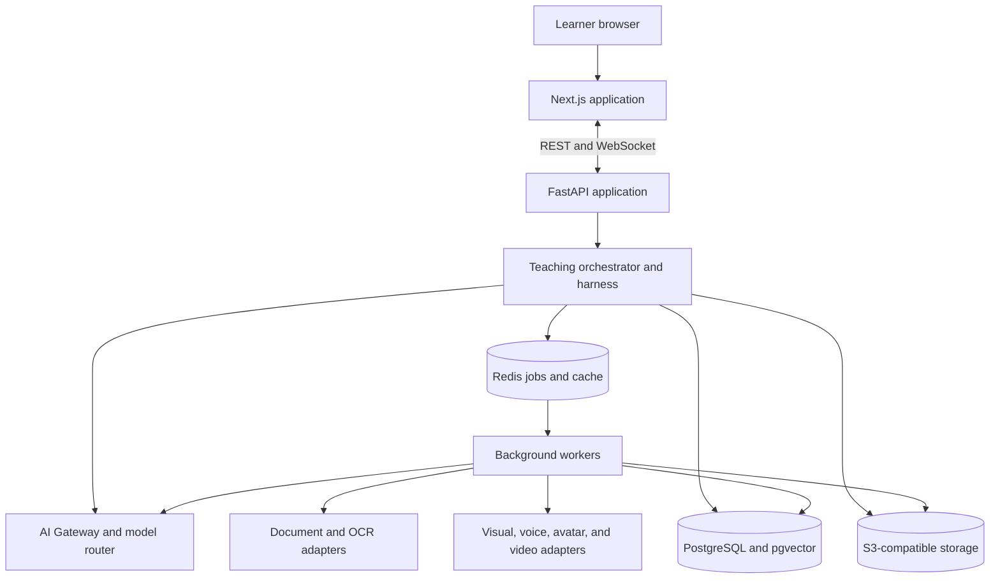

# AI Teacher Technology Stack

## Status and authority

This document translates `../../AI_Teacher_Complete_Technology_Stack.md` into the approved implementation baseline. Product behavior remains authoritative in the PRD, while this document governs technology choices. All components are planned until `../execution/features.md` marks them complete.

## Locked stack

| Layer | Technology | Purpose |
| --- | --- | --- |
| Web | Next.js, React, TypeScript, Tailwind CSS | Responsive learner and administration application |
| UI support | Recharts, Lucide, Framer Motion | Analytics, icons, and restrained player transitions |
| API | Python, FastAPI, Pydantic | REST/WebSocket endpoints, orchestration, and validated contracts |
| Persistence | PostgreSQL, pgvector | Transactional system of record, full-text search, and vector search |
| Temporary state/jobs | Redis and a background worker | Cache, session coordination, and asynchronous ingestion/media jobs |
| Documents | PyMuPDF, python-docx, python-pptx, OCR adapter | Structured PDF, DOCX, PPTX, scanned-document, and image extraction |
| Retrieval | Multilingual embeddings, PostgreSQL full-text search, hybrid retrieval, reranker | Grounded evidence packs with document/page/section references |
| AI | Provider-neutral AI Gateway, model router, prompt registry, evaluators | Task-specific LLM and generative-model access without domain coupling |
| Teaching control | Python state machine, policy engine, tool registry, Pydantic validators | Deterministic control around probabilistic model output |
| Visuals | SVG, LaTeX, Matplotlib, Mermaid, image-generation adapter | Exact technical visuals and appropriate generated illustrations |
| Voice/media | STT, multilingual TTS, avatar/video provider adapters, FFmpeg | Voice interaction and short, adaptive lesson segments |
| Storage | S3-compatible object storage | Source documents and generated media |
| Realtime | WebSockets | Job progress and interactive lesson events |
| Quality | pytest, frontend component tests, Playwright, AI evaluation suites | Unit, integration, contract, end-to-end, and model-quality checks |
| Operations | Docker, GitHub Actions, structured JSON logs, OpenTelemetry | Reproducible deployment, CI/CD, and distributed tracing |

Minor versions and concrete AI, OCR, speech, avatar, image-generation, cloud, authentication, and object-storage vendors are selected through decision records and locked manifests. Significant third-party APIs, models, libraries, licenses, data boundaries, and limitations must be disclosed before deployment.

## Runtime topology



Start as a modular monolith with separately scalable workers. Do not split the system into microservices or introduce Kubernetes until measured scale, isolation, or ownership needs justify it.

## AI Gateway

Application and agent code call capability-based interfaces rather than vendor SDKs. The gateway routes planning, teaching, evaluation, translation, embedding, reranking, visual planning, image generation, speech, and avatar work to configured providers. Each adapter must implement timeouts, bounded retries, normalized errors, telemetry, usage/cost reporting, test fakes, and contract tests.

Model output is untrusted. The harness accepts it only after schema, evidence, safety, permission, and state-transition validation. Provider failure produces a controlled retry, fallback, or visible degraded state; it never bypasses teaching policy.

## Retrieval and document processing

```text
PDF / DOCX / PPTX / TXT / image
  -> parser or OCR
  -> structure and location extraction
  -> semantic chunks
  -> multilingual embeddings + keyword index
  -> owner-filtered hybrid retrieval
  -> reranking
  -> evidence pack with citations
  -> model
```

- PyMuPDF retains PDF page positions and metadata.
- `python-docx` retains DOCX headings, paragraphs, and tables.
- `python-pptx` retains slide order, text, and structure.
- OCR is pluggable so Tesseract or a disclosed cloud OCR service can be selected per deployment.
- Retrieval filters include owner, document, chapter, section, page/slide, concept, language, and difficulty.

## Cognitive engine and teaching harness

The cognitive engine stores explicit learner profile, concept mastery, observations, confidence-scored misconceptions, session memory, long-term learning history, and concept prerequisites. It does not rely on chat history as the source of truth.

The deterministic harness owns the workflow:

```text
UNDERSTAND -> PLAN -> TEACH -> QUESTION -> EVALUATE
                                      |-> PASS -> ADVANCE
                                      |-> STRUGGLE -> REEXPLAIN
                                                     -> NEW EXAMPLE
                                                     -> NEW QUESTION
ASSESSMENT -> REPORT -> END
```

Only validated structured output can propose an action; the policy engine authorizes transitions and persistence.

## Visual, voice, avatar, and video pipeline

Prefer deterministic rendering when correctness matters: LaTeX for equations, Matplotlib for graphs, Mermaid/SVG for flows and diagrams, and HTML/CSS/SVG for overlays. Use an image-generation adapter for illustrative content.

Teacher scripts pass through multilingual TTS and then an avatar/video adapter. Student microphone input passes through STT, with typed input always available. FFmpeg normalizes audio, prepares captions, converts formats, and assembles short segments. Generated files are stored in object storage. Short segments are mandatory so the system can pause, assess, adapt, and select the next segment instead of committing to one long video.

## Realtime and asynchronous work

FastAPI returns `202 Accepted` for long ingestion, AI, and media operations. Redis-backed workers process jobs with idempotency keys, bounded retries, deadlines, cancellation, heartbeat, and dead-letter state. WebSocket events include `lesson_started`, `segment_ready`, `question_ready`, `student_answer_received`, `evaluation_ready`, `adaptation_selected`, `next_segment_ready`, and `assessment_complete`. REST remains available for command submission and state reconciliation.

## Data placement

| Data | Store |
| --- | --- |
| Users, profiles, lessons, answers, mastery, recommendations, traces | PostgreSQL |
| Chunks and metadata | PostgreSQL |
| Embeddings | pgvector |
| Temporary cache, presence, and job coordination | Redis |
| Uploaded documents and generated audio/video/images/captions | S3-compatible object storage |

## Security and observability

Authentication may use a managed identity provider or secure FastAPI-issued sessions/JWT, but every query and object key remains owner-scoped. Secrets stay server-side. External AI/media calls receive only the minimum data required for their declared purpose, and production requires consent, retention, residency, and vendor reviews.

Structured traces record session and actor identifiers, state, concept, retrieval query and chunk IDs, model/provider, prompt version, evaluation score, misconception, policy decision, next action, latency, job state, usage/cost, and fallback without logging source text, full answers, credentials, or tokens by default. OpenTelemetry connects browser, API, worker, database, retrieval, and provider operations.

## Deployment profile

Use Docker for reproducibility and GitHub Actions for lint, type, test, migration, build, security, and deployment gates. A simple cloud deployment consists of the Next.js application, FastAPI API, worker processes, managed PostgreSQL/pgvector, managed Redis, and S3-compatible storage. Keep provider and infrastructure choices replaceable; avoid Kubernetes for the initial delivery.

## Implementation order

1. Next.js, FastAPI, PostgreSQL/pgvector, Redis, and object storage foundation.
2. Authentication, document ingestion, OCR, and grounded hybrid retrieval.
3. Cognitive learner state, lesson planning, and deterministic teaching harness.
4. Questions, evaluation, misconception detection, adaptation, reports, and recommendations.
5. Deterministic visuals, TTS, avatar/video, FFmpeg, and short-segment playback.
6. Multilingual support, observability, quality evaluation, Docker deployment, and demo hardening.

